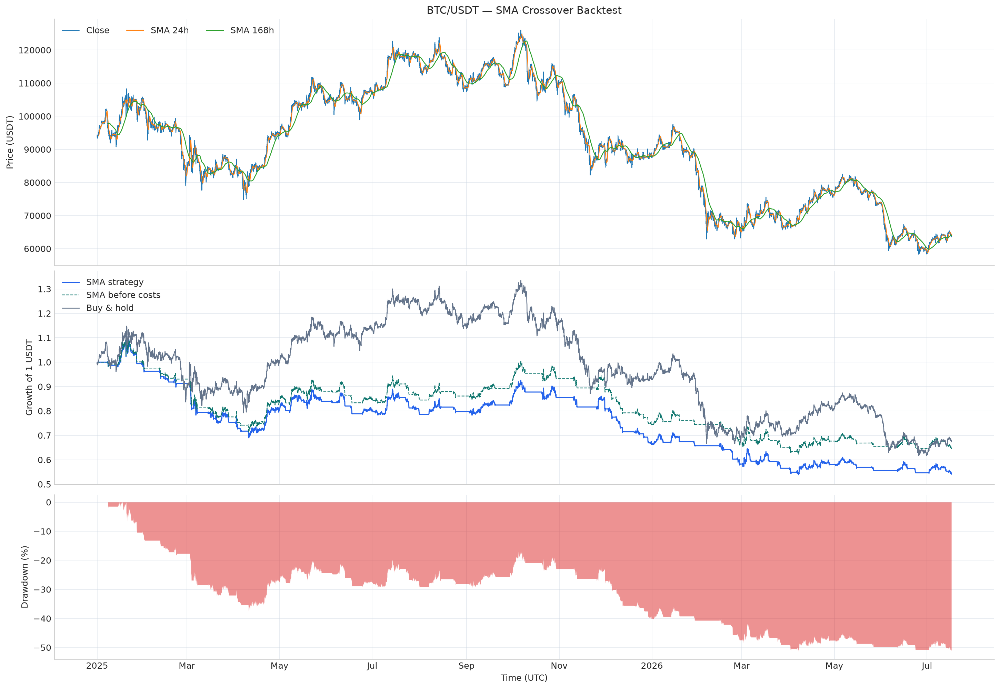

# SMAクロス戦略 バックテストレポート

## 戦略

- 対象: `BTC/USDT` 1時間足
- ルール: 24時間SMAが168時間SMAを上回る間はロング、それ以外は現金
- 約定: シグナルを1時間遅らせて反映（先読み防止）
- 取引コスト: 売買ごとに `0.12%`（手数料 `0.10%` + スリッページ `0.02%`）
- 対象期間: 2025-01-01T00:00:00+00:00 ～ 2026-07-17T01:00:00+00:00（13,490本）

## 結果

| 指標 | 結果 |
|---|---:|
| 累積リターン | -45.89% |
| 取引コスト控除前の累積リターン | -35.59% |
| 取引コストによる累積リターン差 | -10.29% |
| 最大ドローダウン | -51.43% |
| 年率シャープレシオ | -1.24 |
| CAGR（年率複利リターン） | -32.91% |
| 年率ボラティリティ | 28.73% |
| Sortinoレシオ | -1.11 |
| Calmarレシオ | -0.64 |
| バイ＆ホールド累積リターン | -32.68% |
| 対バイ＆ホールド超過リターン | -13.20% |
| 市場エクスポージャー | 49.27% |
| 取引回数 | 73 |
| 勝率 | 26.03% |
| プロフィットファクター | 0.54 |
| 平均トレードリターン | -0.78% |
| 平均保有時間 | 91.0 時間 |
| 最大ドローダウン継続時間 | 13025 時間 |
| 総売買回転量 | 145 回分 |
| 単純合算した推定取引コスト | 17.40% |

## 結果の読み取り

- 戦略の累積リターンはバイ＆ホールドを `13.20`ポイント下回りました。
- コスト控除前でも累積リターンは `-35.59%` で、シグナル自体がこの期間に有効ではありませんでした。取引コストはさらに `10.29`ポイント成績を押し下げました。
- 勝率は `26.03%`、プロフィットファクターは `0.54` です。1未満のプロフィットファクターは、利益合計より損失合計が大きかったことを示します。
- 市場エクスポージャーを `49.27%` に抑えても最大ドローダウンは `-51.43%` であり、このルールだけでは十分な下落抑制ができませんでした。

## 注意点

- リスクフリーレートは0%としてシャープレシオを計算しています。
- 税金、スプレッド、資金調達コスト、市場インパクトは含みません。
- 現物のロング／キャッシュを想定し、ショートやレバレッジは使用しません。
- 過去の結果は将来の運用成績を保証しません。
